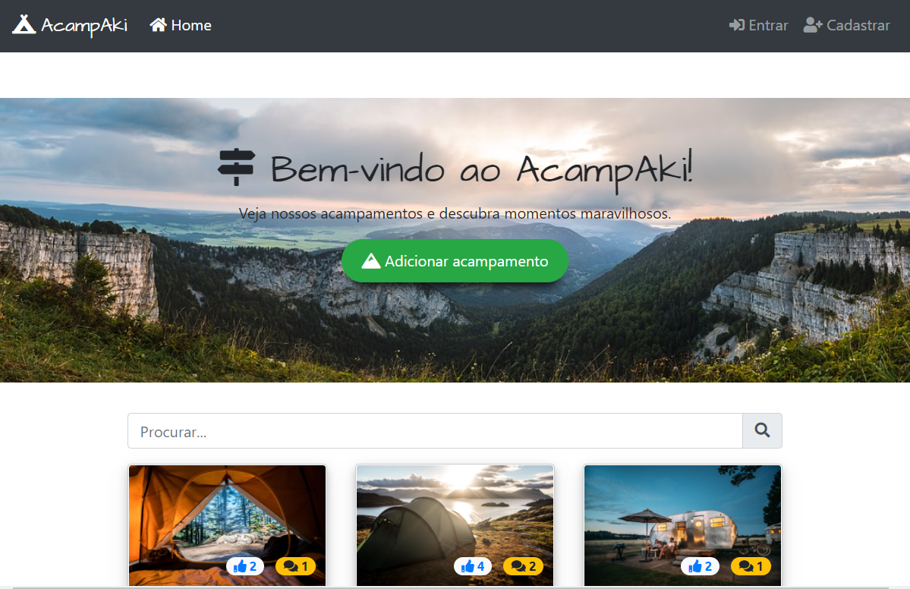

<!-- PROJECT LOGO -->
<br />
<p align="center">
    

  <h3 align="center">AcampAki</h3>

  <p align="center">
    A fullstack project
    <br />
    <a href="https://acampaki.herokuapp.com/"><strong>Demo »</strong></a>
  </p>
</p>

<!-- ABOUT THE PROJECT -->

# AcampAki

This is my first project, built for my <a href="https://www.udemy.com/course/the-web-developer-bootcamp/">Web Developer Bootcamp course</a> from <a href="https://www.youtube.com/channel/UCrqAGUPPMOdo0jfQ6grikZw">Colt Steele</a>

AcampAki is based on the popular Yelp website, but it focuses on campgrounds so that anyone can post and get reviews.


<!-- LIVE DEMO -->
## Live Demo
<a href="https://acampaki.herokuapp.com/"><strong>You can check it here</strong></a>


<!-- BUILT WITH -->
## Built With
- MongoDB
- Express
- NodeJS
- REST
- PassportJS
- HTML5
- CSS3
- DOM
- JQuery
- Heroku

<!-- FUNCTIONALITIES -->
## Functionalities
- User authentication.
- Anyone can check out the campground.
- User will have to login to post a new campground or edit it.
- User will have to login to post a new comment or edit it.
- User will have to login to like a campground.
- Display campground location on Google Maps.
- Snackbar messages to inform the status of the action (success/error)
- Responsive design.

<!-- GETTING STARTED -->

## Getting Started


### Installation

1. Clone the repo

```sh
git clone https://github.com/milenayamamoto/yelpcamp.git
```

2. Install NPM packages

```sh
npm install
```

or

```sh
yarn install
```